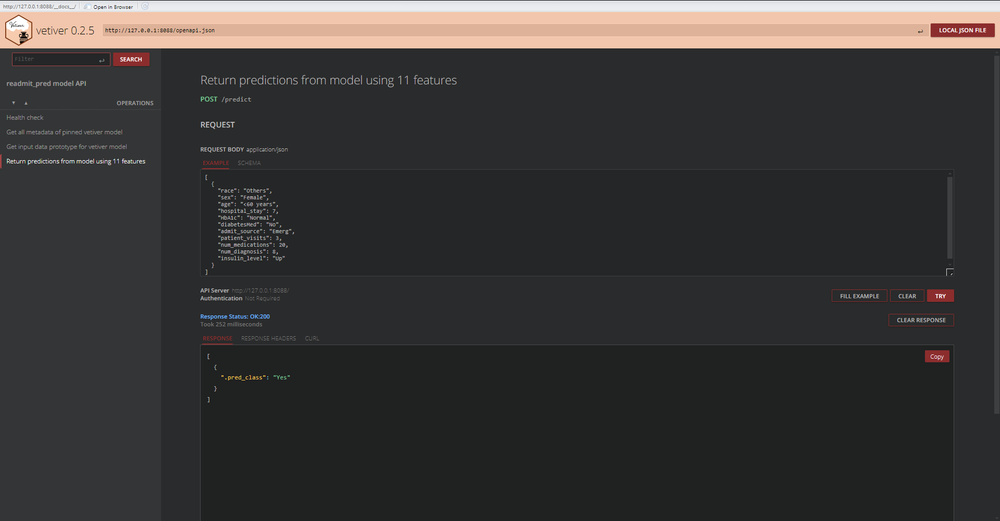
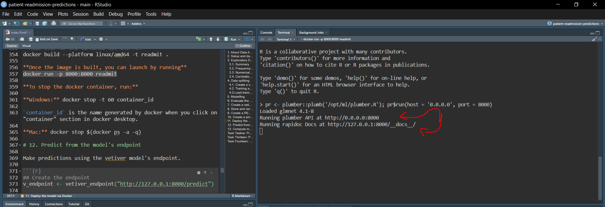
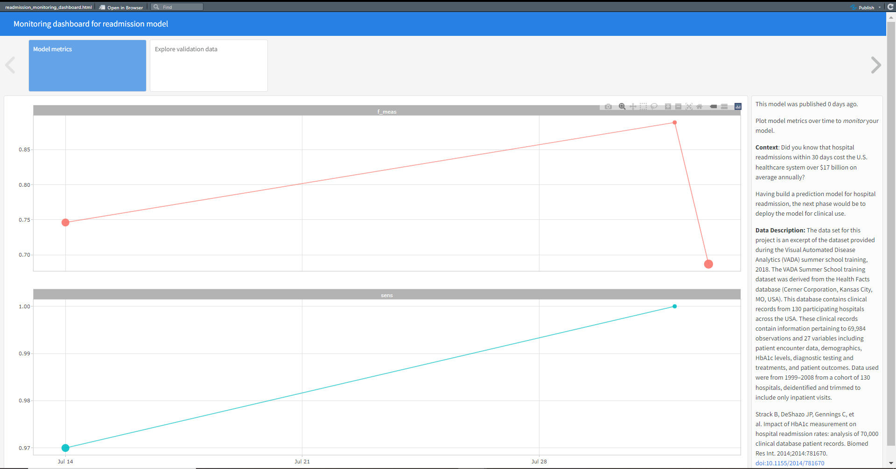

# Patient readmission predictions

Hospital readmissions within 30 days cost the U.S health care system over \$17 billion on average annually. In this project, we build and deploy a predictive model using R, tidymodels, docker, and vetiver.

## Project results

Our dataset has 16458 observations and 13 features whore 1 is a date, 8 are categorical, and 4 numerical.

There was no missing values in the dataset and only feature encoding, feature transformation (log,BoxCox, etc), and feature engineering would have helped.

8 different models were built: logistic regression, decision tree, naive bayes, k-NN, random forest, svm linear and svm RBF, and xgboost. After which they were stacked (ensembled) to build a better model which achieved 0.73% on testing data using \`F1 score\`.

Developed a Plumber API which was tested as seen below.

Further containerized the model using Docker and deployed it locally for testing purpose as seen below:

Finally using markdown template, developed a monitoring dashboard using the validation set which was not used before.

It was a nice project, and hopefully we do more in the upcoming future.
